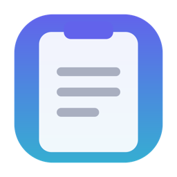
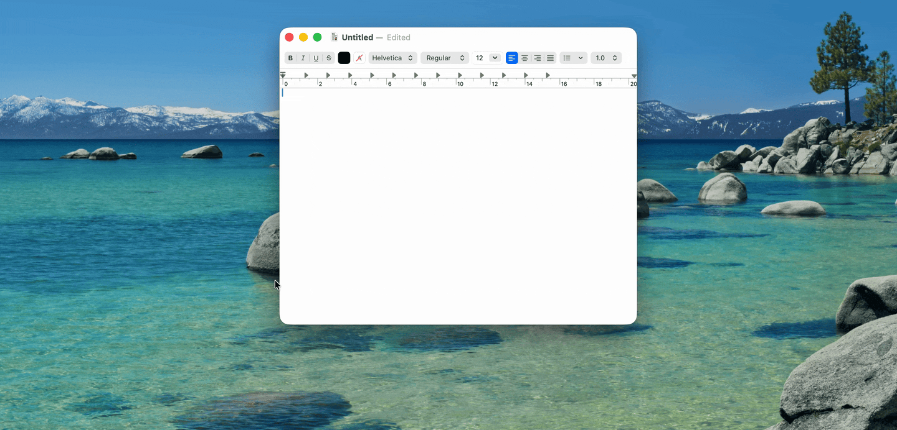

<p align="center">
  
</p>

<h1 align="center">Recall</h1>

<p align="center">Keyboard-first clipboard history for macOS.</p>

<p align="center">
  
</p>

Press **⌘⇧V** in any app and your recent clipboard slides up from the bottom of the screen. Glance, arrow to the item you want, hit **Enter** — it's pasted right where you were typing. Your hands never leave the keyboard, and the overlay is gone before you've finished the thought.

## Why Recall?

- **Keyboard-first.** The system clipboard remembers exactly one thing, and most clipboard managers make you mouse through a menu to get the rest back. Recall's entire loop — summon, pick, paste — is keystrokes.
- **Private by design.** History lives in a local SQLite database on your Mac. No cloud sync, no network calls, no analytics. Copies from password managers are masked on screen and auto-expire after 15 minutes.
- **Native and lightweight.** Swift and AppKit, menu bar only, no dock icon, under 30 MB at idle. Open source under MIT — not an Electron wrapper or a subscription.

## Install

```sh
brew install --cask jtreanor/recall/recall
```

The cask removes the macOS quarantine attribute, so the app opens on first launch without a Gatekeeper prompt. Requires macOS 13 Ventura or later.

### Accessibility permission

On first launch, Recall asks for **Accessibility** permission. It needs this for one thing: pasting. Recall puts your chosen item on the pasteboard, switches back to the app you came from, and sends a synthetic **⌘V** keystroke — and macOS requires Accessibility permission to send keystrokes. Nothing else is read or monitored through it.

If you decline, Recall still captures history and copies items to the clipboard; you just paste manually with ⌘V.

### Manual install

Download the latest `Recall.dmg` from [Releases](../../releases) and drag Recall to Applications. Because the app is ad-hoc signed, macOS may block the first launch — right-click → Open, or run:

```sh
xattr -d com.apple.quarantine /Applications/Recall.app
```

## Usage

Press **⌘⇧V** anywhere. The overlay shows your recent items as cards, newest first, each with the icon of the app it was copied from.

Recall captures **text** (with rich-text formatting preserved), **images**, **URLs** (labeled with their domain), and **files** copied in Finder — multi-file copies stay together as a single item.

**Search:** just start typing. The list filters as you type; Backspace edits the search before it deletes anything.

| Key | Action |
|---|---|
| `←` `→` | Move between items |
| `Enter` (or click) | Paste into the app you came from |
| `Backspace` | Delete selected item (clears search first) |
| `Esc` | Dismiss |
| `⌘,` | Open Settings |

## Settings

Open Settings from the menu bar icon or press **⌘,** while the overlay is visible.

| Setting | Default |
|---|---|
| Hotkey | ⌘⇧V |
| History limit | 200 items |
| Store passwords | On |
| Plain Text Only (paste without formatting) | Off |
| Open at Login | Off |

## How it works

Recall polls `NSPasteboard.general.changeCount` every 0.75 s on a background queue and stores new items in SQLite under `~/Library/Application Support/Recall/` — everything stays on disk, on your machine. The overlay is an `NSPanel` at floating window level; paste-back writes to the pasteboard, re-activates the previously frontmost app, and posts a synthetic ⌘V `CGEvent`.

## Build from source

```sh
# Prerequisites: Xcode 15+, xcodegen
brew install xcodegen

git clone https://github.com/jtreanor/recall.git
cd recall
xcodegen generate
open Recall.xcodeproj
```

Run tests:

```sh
xcodebuild test -project Recall.xcodeproj -scheme Recall -destination 'platform=macOS'
```

Build a distributable DMG with `./scripts/distribute.sh` (output in `build/dist/`).

## License

MIT — see [LICENSE](LICENSE).
